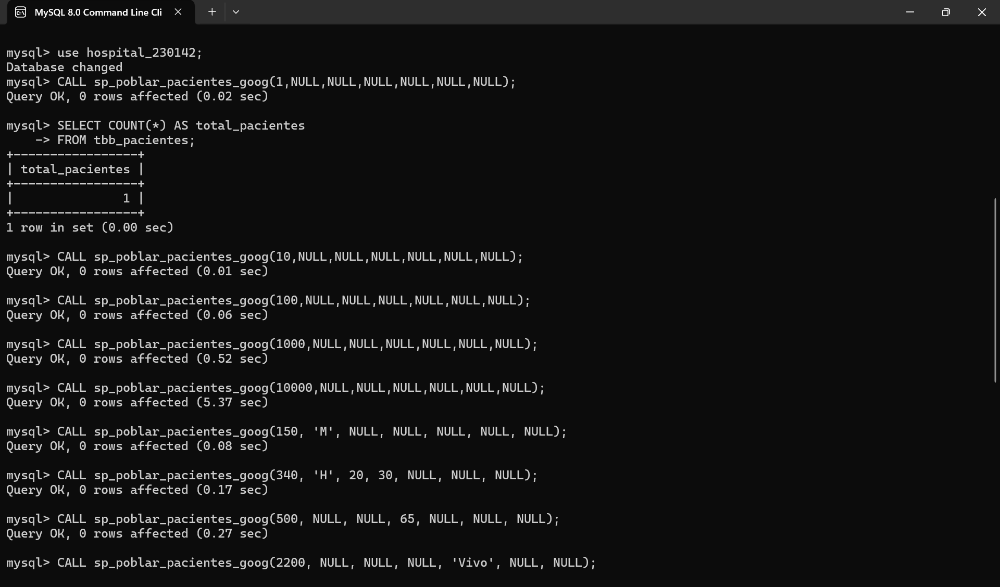
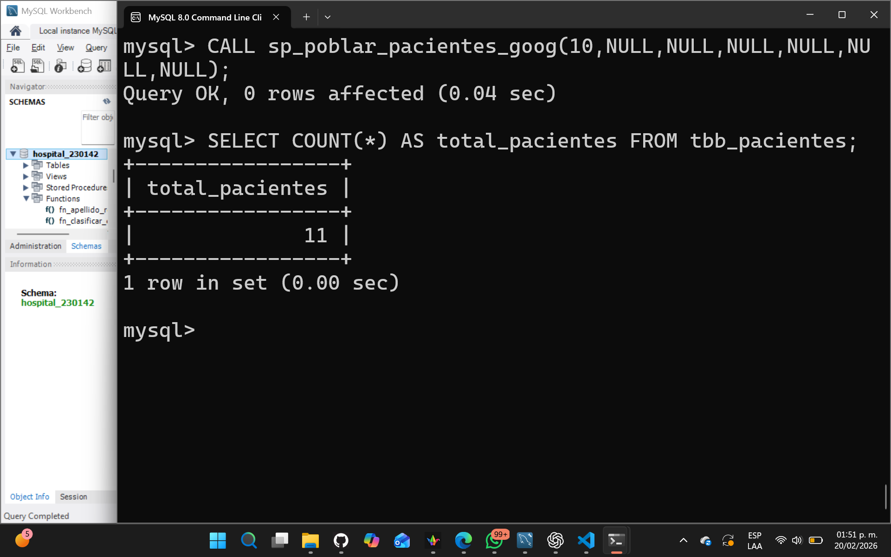
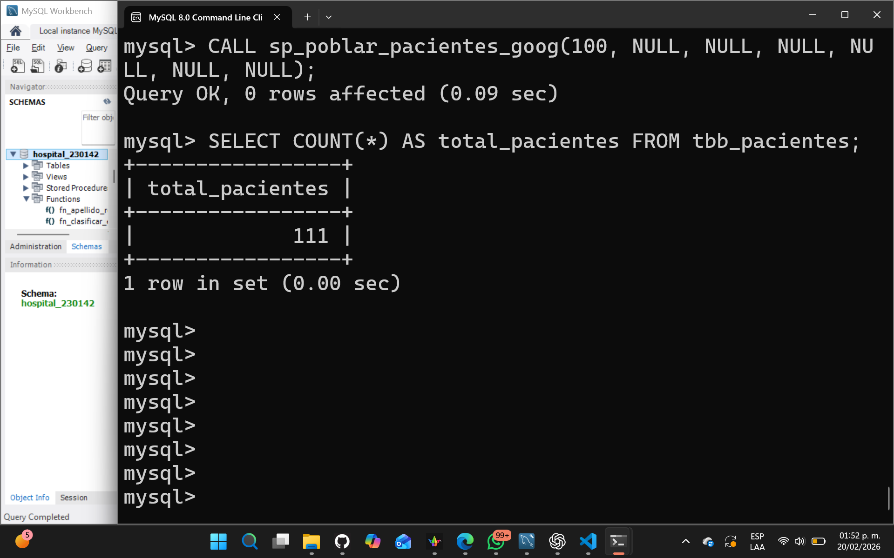
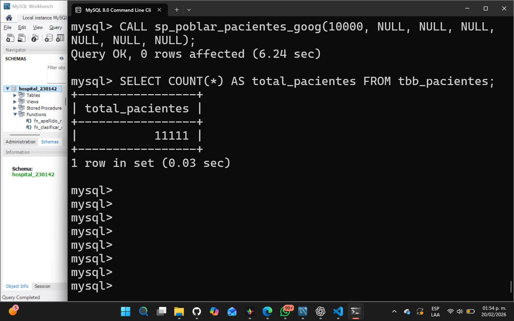
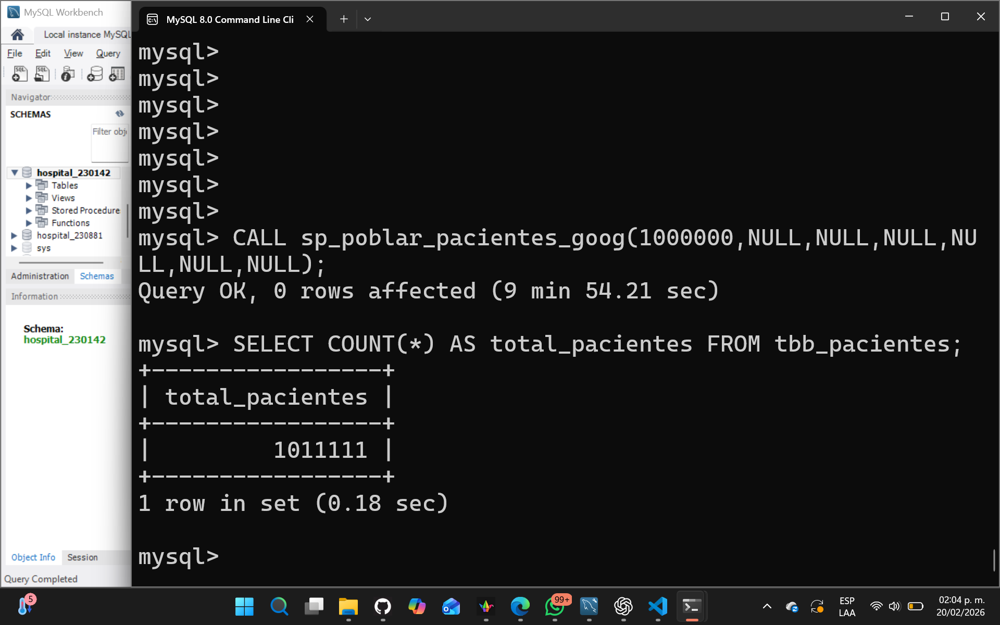
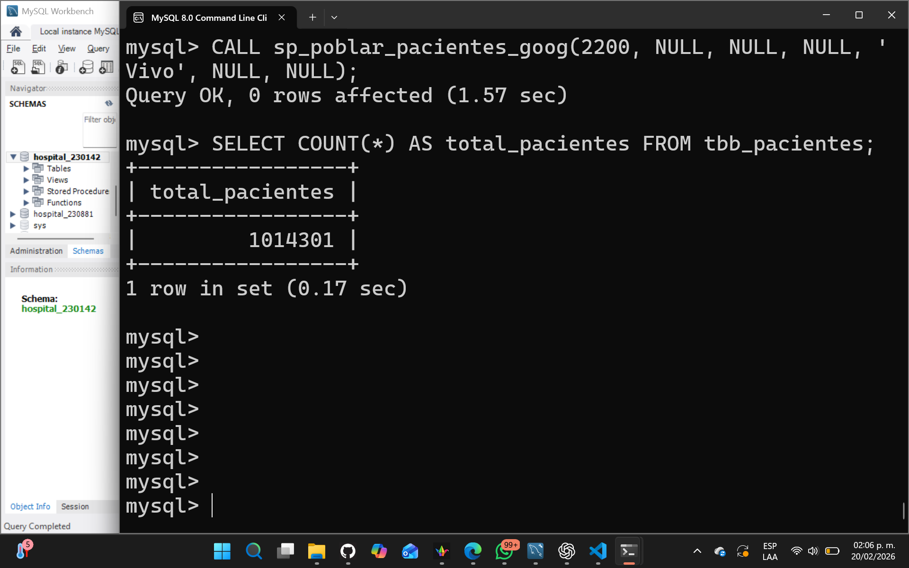
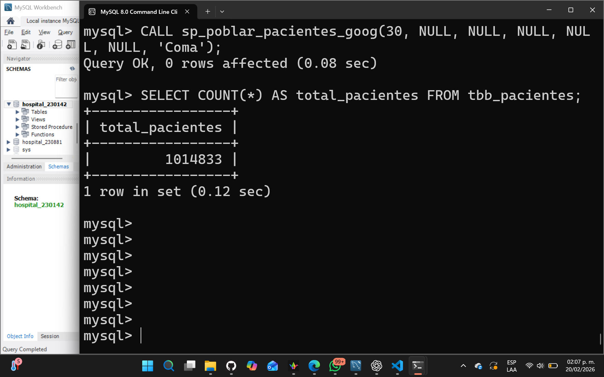
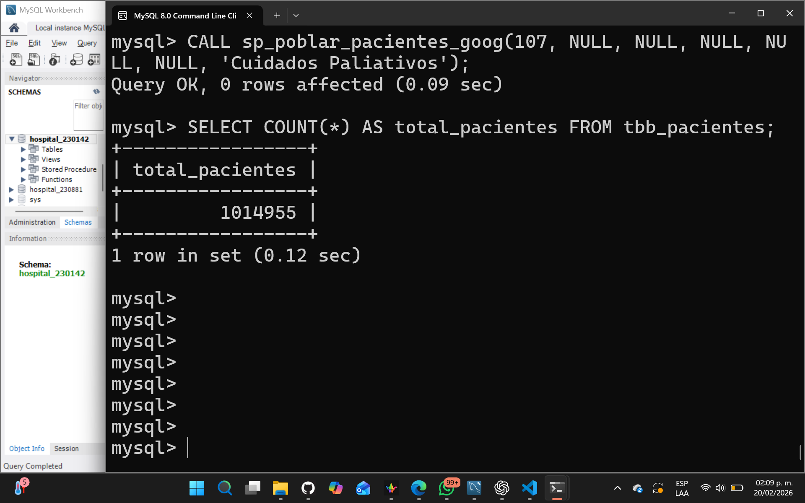
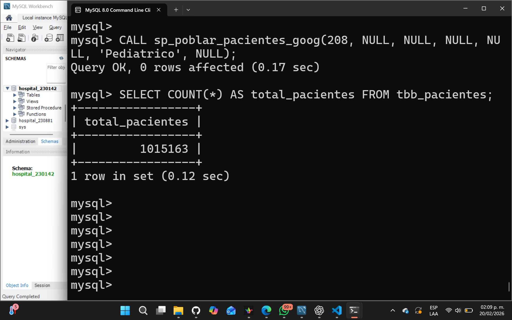
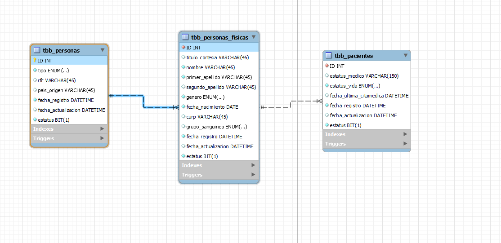

# Pruebas – sp_poblar_pacientes_goog

Este documento presenta las pruebas de volumen y naturaleza
realizadas al procedimiento almacenado `sp_poblar_pacientes_goog`.

Las evidencias gráficas se encuentran en la carpeta `assets/`.

---

# 🔵 PRUEBAS DE VOLUMEN

## Test 01 – Registro de 1 Paciente

CALL sp_poblar_pacientes_goog(1, NULL, NULL, NULL, NULL, NULL, NULL);

---

## Test 02 – Registro de 10 Pacientes

CALL sp_poblar_pacientes_goog(10, NULL, NULL, NULL, NULL, NULL, NULL);}

---

## Test 03 – Registro de 100 Pacientes

CALL sp_poblar_pacientes_goog(100, NULL, NULL, NULL, NULL, NULL, NULL);

---

## Test 04 – Registro de 1000 Pacientes

CALL sp_poblar_pacientes_goog(1000, NULL, NULL, NULL, NULL, NULL, NULL);

---

## Test 05 – Registro de 10000 Pacientes

CALL sp_poblar_pacientes_goog(10000, NULL, NULL, NULL, NULL, NULL, NULL);

---

## Test 06 – Registro de 1000000 Pacientes

CALL sp_poblar_pacientes_goog(1000000, NULL, NULL, NULL, NULL, NULL, NULL);

---

# 🟣 PRUEBAS DE NATURALEZA

## Test 07 – Registro de 150 Pacientes Mujeres

CALL sp_poblar_pacientes_goog(150, 'M', NULL, NULL, NULL, NULL, NULL);

---

## Test 08 – Registro de 340 Pacientes Varones entre 20 y 30 años

CALL sp_poblar_pacientes_goog(340, 'H', 20, 30, NULL, NULL, NULL);

---

## Test 09 – Registro de 500 Pacientes con edad máxima de 65 años

CALL sp_poblar_pacientes_goog(500, NULL, NULL, 65, NULL, NULL, NULL);

---

## Test 10 – Registro de 2200 Pacientes Vivos

CALL sp_poblar_pacientes_goog(2200, NULL, NULL, NULL, 'Vivo', NULL, NULL);

---

## Test 11 – Registro de 502 Pacientes Mujeres Finadas mayores de 45 años

CALL sp_poblar_pacientes_goog(502, 'M', 46, NULL, 'Finado', NULL, NULL);

---

## Test 12 – Registro de 30 Pacientes en Coma

CALL sp_poblar_pacientes_goog(30, NULL, NULL, NULL, NULL, NULL, 'Coma');

---

## Test 13 – Registro de 15 Pacientes en Estado Vegetativo

CALL sp_poblar_pacientes_goog(15, NULL, NULL, NULL, NULL, NULL, 'Estado Vegetativo');

---

## Test 14 – Registro de 107 Pacientes en Cuidados Paliativos

CALL sp_poblar_pacientes_goog(107, NULL, NULL, NULL, NULL, NULL, 'Cuidados Paliativos');

---

## Test 15 – Registro de 208 Pacientes Pediátricos

CALL sp_poblar_pacientes_goog(208, NULL, NULL, NULL, NULL, 'Pediatrico', NULL);

---

# Conclusión General

Las pruebas de volumen y naturaleza se ejecutaron correctamente.
El procedimiento demostró capacidad para:

- Generar grandes volúmenes de datos.
- Respetar filtros de género.
- Respetar rangos de edad.
- Aplicar estatus de vida específicos.
- Aplicar estatus médicos específicos.
- Clasificar correctamente pacientes pediátricos.

Se validó la integridad relacional entre:

- tbb_personas
- tbb_personas_fisicas
- tbb_pacientes

  

